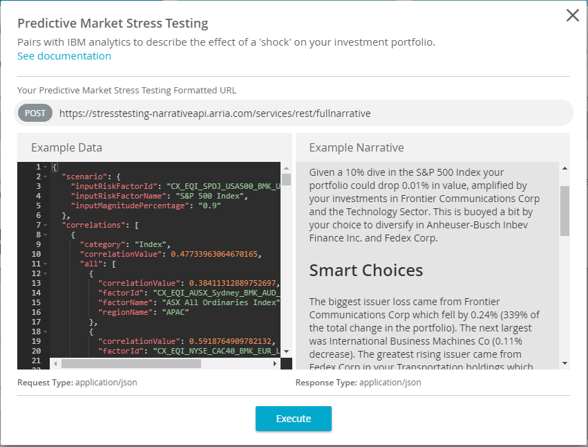

---

copyright:

  years:  2017

lastupdated: "2017-10-26"

---

{:new_window: target="_blank"}
{:shortdesc: .shortdesc}
{:screen:.screen}
{:codeblock:.codeblock}
{:pre: .pre}

<!-- The name of this file must remain index.md. -->

# Getting started with Natural Language Generation APIs
{: #gettingstarted_nlgapi}

With Arria’s Natural Language Generation APIs, you can quickly and easily integrate NLG into your application to add context-aware, instantly updatable, domain-relevant narrative explanation of any data. Arria NLG’s patented AI technologies provide real-time advanced data analysis and commentary. Any application that presents information to be analyzed—whether presented in the form of a visualization, a table, or another format—can be enhanced with the addition of a description explaining the key insights.
{:shortdesc}

## Before you begin

To use Arria’s APIs, it is important that you understand the basics of RESTful web services and JSON representations.
Through Bluemix, you bind Arria’s Natural Language Generation APIs service to your application in the same way that you would add any service available on Bluemix. 

You need cURL, or another data transfer tool, installed before you can use the service. To get the sample JSON files available for use with Arria’s NLG APIs, see the [Natural Language Generation APIs Service Sample Data Set](https://nlgapi.arria.com/assets/data/samples/predictive_market_stress_testing.json){: new_window}.

Use the following steps to access Arria’s Natural Language Generation APIs service, one of Arria’s sample NLG APIs:
1.	Get your credentials.
2.	Try out creating a narrative.
3.	Connect the Natural Language Generation APIs service to your application.
4.	Call the Natural Language Generation APIs service.

More detailed information for each of the main steps is provided in the sections that follow.

## Getting your credentials

You can obtain the credentials you need to access the Natural Language Generation APIs service by signing up with Arria NLG for a trial account. Follow the instructions [here](https://nlgapi.arria.com/documentation/credentials.html){: new_window}.

## Trying out creating a narrative

The Predictive Market Stress Testing Narrative API preview dialog is the place to test out the Natural Language Generation APIs service. Maybe you already tried it out when you were getting your credentials? If not, follow the instructions [here](https://nlgapi.arria.com/documentation/predictive_market_stress_testing_doc.html){: new_window} to try out creating a narrative. You can use this [sample JSON file](https://nlgapi.arria.com/assets/data/samples/predictive_market_stress_testing.json){: new_window}.

## Connecting the service to your application

In the Bluemix console, once you have added your credentials in the Add Service form for the Natural Language Generation APIs service, you click the **Create** button. After that, you should see the service in your Dashboard.

Now you connect the Natural Language Generation APIs service to your application, then restage your application.
1.	Click the service name in your Services list.
2.	In the information page for the service, navigate to Connections and click the **Create Connection** button.
3.	In the row for your application, click the **Connect** button.
4.	In the Restage App dialog, click **Restage** to restage your application with the new service connection. 

## Calling the Natural Language Generation APIs service

Once you have gotten a preview of the narrative output from your JSON file, you can decide what you want to do with NLG in your application. Follow the [instructions](https://nlgapi.arria.com/documentation/predictive_market_stress_testing_doc.html){: new_window} to see an example API call and to apply the API key in your requests.

## About Arria NLG

Arria’s Natural Language Generation (NLG) solutions enjoy a substantial competitive edge in the market place for a few important reasons. Arria NLG technology extracts key insights directly from underlying data to create unique data-driven narratives every time. Other NLG systems are also data-driven but limited by predetermined “fill in the blanks” templated narratives. 

In the Predictive Market Stress Testing starter kit, for example, one of Arria’s Natural Language Generation APIs teams up with three other Bluemix services to generate a correlated market stress test and analysis that lets investors see what different market conditions would do to an investment portfolio. One service loads the end user’s investment portfolio. Another service creates scenarios to run for predicting outcomes of market changes. The third runs an analysis and displays a table with current values as well as stressed values (those resulting from the chosen scenario). Arria’s Natural Language Generation API provides supplemental narrative analysis that appears as if human-written, calling out and describing the most important facts and ideas—from the perspective of a wealth manager or research analyst—that can be derived from the data displayed.

Arria NLG technology captures industry expertise and the interpretation strategy of the expert. Other NLG systems simply automate the generation of predictive text. 
Arria NLG technology is based on over 30 years of data science and computational linguistic expertise. Other NLG systems are fairly new and may bump into Arria’s patents as they progress.
For additional information, visit [www.arria.com](https://www.arria.com/){: new_window}. Follow Arria NLG on [Twitter](https://twitter.com/ArriaNLG){: new_window}, [LinkedIn](https://www.linkedin.com/company/arria-nlg/){: new_window}, [Google+](https://plus.google.com/101196721072588368920){: new_window} and [YouTube](https://www.youtube.com/user/ARRIAnlg){: new_window}.
