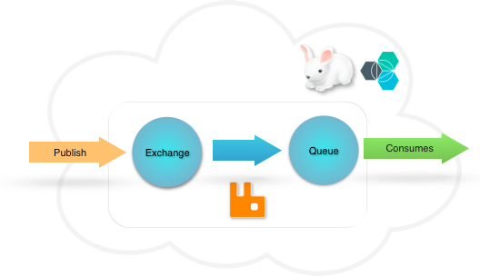

---

copyright:

  years: 2016

lastupdated: "2016-04-14"

---

{:new_window: target="_blank"}
{:shortdesc: .shortdesc}
{:screen:.screen}
{:codeblock:.codeblock}
{:pre: .pre}

# Getting started with CloudAMQP
{: #gettingstarted}

CloudAMQP on Bluemix are RabbitMQ servers hosted in the cloud. 
{:shortdesc}

If you are new to RabbitMQ, we recommend you read the guide [RabbitMQ for beginners](https://www.cloudamqp.com/blog/2015-05-18-part1-rabbitmq-for-beginners-what-is-rabbitmq.html?cm_mc_uid=22273308531414543392018&cm_mc_sid_50200000=1458671296) before continuing.




## Integrating your app with the service 

All AMQP client libraries work with CloudAMQP and there are AMQP client libraries for almost every platform. Sample code, links to recommended libraries and further information about the client libraries can be found in [the CloudAMQP documentation](https://www.cloudamqp.com/docs/index.html). 

Complete these steps to get started with the CloudAMQP service:

1.  Add the client library to your dependencies file. The library will be downloaded automatically when you deploy your app. CloudAMQP recommended client libraries for different languages can be found here:  [Ruby](https://www.cloudamqp.com/docs/ruby.html){:new_window}, [Python](https://www.cloudamqp.com/docs/python.html){:new_window}, [Celery](https://www.cloudamqp.com/docs/celery.html){:new_window}, [node.js](https://www.cloudamqp.com/docs/nodejs.html){:new_window}, [PHP](https://www.cloudamqp.com/docs/php.html){:new_window}, [Java](https://www.cloudamqp.com/docs/java.html){:new_window}, [Clojure](https://www.cloudamqp.com/docs/clojure.html){:new_window}, [Go](https://www.cloudamqp.com/docs/go.html){:new_window}, [Android](https://www.cloudamqp.com/docs/android.html){:new_window}, [.NET](https://www.cloudamqp.com/docs/dotnet.html){:new_window}, [Perl](https://www.cloudamqp.com/docs/perl.html){:new_window} and [C](https://www.cloudamqp.com/docs/c.html){:new_window}. For example, in Ruby, open the Gemfile and add gem ‘bunny’. 
    
    ```
    gem 'bunny'
    ```
    {: pre}
    
2.  Copy the code from the the same language-specific link as above. For example, in Ruby: 

    ```
    require "bunny" # don't forget to put gem "bunny" in your Gemfile 

    services = JSON.parse(ENV['VCAP_SERVICES'])
    cloudamqp_conf = services["cloudamqp"].first
    uri = cloudamqp_conf["credentials"]["uri"]

    b = Bunny.new uri
      
    b.start # start a communication session with the amqp server
      
    ch = b.create_channel # create a channel

    q = ch.queue("test") # declare a queue
      
    # declare a default direct exchange, which is bound to all queues
    e = ch.exchange("")

    # publish a message to the exchange, the message will be routed to the queue "test"
    e.publish("Hello, everybody!", key: value)
      
    # subscribe from the queue
    q.subscribe(block: true) do |delivery_info, properties, payload|
       puts "This is your message: " + payload + "\n\n"
       b.stop # close the connection
    end
    ```
    {: codeblock}

3. Set up connection Environment Variable: The connection and credential information for CloudAMQP is available in the Bluemix VCAP_SERVICES environment variable. It’s a nested JSON objected with all service credentials. 


<!-- Related links section: moved to TOC.
# Related Links
{: #rellinks notoc}

## Tutorials and Samples
{: #samples}

* [Ruby](https://www.cloudamqp.com/docs/ruby.html){:new_window}
* [Python](https://www.cloudamqp.com/docs/python.html){:new_window}
* [Celery](https://www.cloudamqp.com/docs/celery.html){:new_window}
* [node.js](https://www.cloudamqp.com/docs/nodejs.html){:new_window}
* [PHP](https://www.cloudamqp.com/docs/php.html){:new_window}
* [Java](https://www.cloudamqp.com/docs/java.html){:new_window}
* [Clojure](https://www.cloudamqp.com/docs/clojure.html){:new_window}
* [Go](https://www.cloudamqp.com/docs/go.html){:new_window}
* [Android](https://www.cloudamqp.com/docs/android.html){:new_window}
* [.NET](https://www.cloudamqp.com/docs/dotnet.html){:new_window}
* [Perl](https://www.cloudamqp.com/docs/perl.html){:new_window}
* [C](https://www.cloudamqp.com/docs/c.html){:new_window}

## Related Links
{: #general}

* [Plans and pricing](https://console.ng.bluemix.net/catalog/services/cloudamqp/){:new_window}
* [FAQ](https://www.cloudamqp.com/docs/faq.html){:new_window}
* [Blog and news](https://www.cloudamqp.com/blog/index.html){:new_window}
 -->
