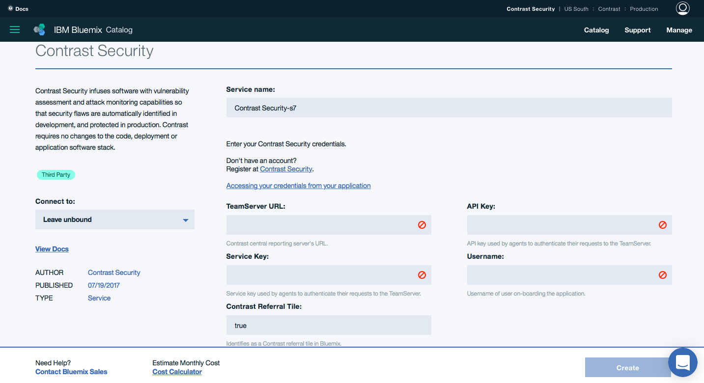

---

copyright:

  years:  2017

lastupdated: "2017-07-19"

---

{:new_window: target="_blank"}
{:shortdesc: .shortdesc}
{:screen:.screen}
{:codeblock:.codeblock}
{:pre: .pre}


# Getting started with Contrast Security
{: #gettingstarted_ContrastSecurity}


Use Contrast Security to detect security vulnerabilities in your application and protect them against attacks.
{:shortdesc}


Before an application developer can use our agent within an app, please visit our [website](https://www.contrastsecurity.com/bluemix) for information about creating an account.

Complete these steps to get started with the Contrast Security service:


1. Step 1. You will need to provide 4 pieces of information to create a service plan.
	
	
	* Contrast Url - The url you use to get to your Contrast dashboard.  In most cases this will be https://app.contrastsecurity.com
	* Api Key - Can be found within Teamserver: Click your name then in the dropdown choose Organization Settings then select API
	* Service Key - Can be found within Teamserver: Click your name then in the dropdown choose Organization Settings then select API
	* Username - email or username used to log into teamserver

2. Step 2. Once the service has been created, you can bind it to an application.
	 Replace contrast-security-service in the example below with the name you used for the service.
	 ```
	 cf bind-service your_app_name contrast-security-service
	 ```
	 {: screen}

3. Step 3. Now that the service has been bound to an application the service plan will be shown in the applications VCAP_SERVICES environment variables.

	```
	"VCAP_SERVICES": {
      "user-provided": [
        {
          "credentials": {
            "api_key": "your_api_key",
            "service_key": "your_service_key",
            "teamserver_url": "https://app.contrastsecurity.com",
            "username": "your_username_or_email",
						"contrast_referral_tile":"true"
          },
          "syslog_drain_url": "",
          "volume_mounts": [],
          "label": "user-provided",
          "name": "contrast-security-service",
          "tags": []
        }
      ]
    }
	```
	{: screen}

4. Step 4 Once the application is restaged the Contrast Security Java Agent will be downloaded and configured to work with your application.
	```
	cf restage your_app_name
	```
	{: screen}


## Support
Any Contrast Security support issues or product feedbacks are welcome via email at support@contrastsecurity.com.