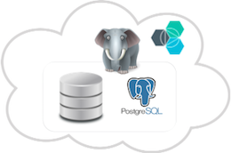

# Getting started with ElephantSQL
*Last updated: 14 April 2016*

<!-- Short description: REQUIRED
The short description section should include one to two sentences describing why a developer would want to use your service in an app. This should be conversational style. For search engine optimization, include the service long name and "Bluemix". Keep the {: shortdesc} after the first paragraph so that the framework renders it properly.

Examples: -->
ElephantSQL is a PostgreSQL database hosting service, offering databases ranging from shared servers for smaller projects and proof of concepts, up to enterprise grade multi server setups. 
{:shortdesc}

<!-- If overview content is required, do not include it here. Put it in a separate "## About" section below the task section. -->

<!-- Task section: REQUIRED
The task section includes steps to integrate the service into the app.  
- With task-based, technical information, reduce the conversational style in favor of succinct and direct instructions.
- DO include the basic, most-common-use scenario steps to use the service or integrate it into the app. 
- DO NOT include steps to add the service from the Bluemix catalog; we assume that the user already took steps in the UI to add the service. 
- DO include code snippets in all languages that can be copied, as well as VCAP service info.  
- For additional tasks like configuring, managing, etc., add a task section (## Gerund_task_title) below the task section or "About" section if used. Use a task title such as "Configuring x", "Administering y", "Managing z". -->

<!-- You can include an optional prerequisites paragraph for any prerequisites to be met before integrating the service. For example: -->




<!-- Include a sentence to briefly introduce the steps. Examples: -->

###Steps to integrate your app with ElephantSQL

Complete these steps to get started with ElephantSQL service:

<!-- Use ordered list markup for the step section. For code examples: 
- use three backticks ahead of and after the example (```)
- For copyable code snippet, multi-line, include {: codeblock} following the last set of backticks. A copy button will display in framework in output.
- For copyable command, single line, include {: pre} following the last set of backticks. When displayed, it will show "$" at the beginning of the command example and a copy button, but the copy button will include just the command example.
- For non-copyable output snippet, include {: screen} following the last set of backticks.
 -->

Once you have created your instance you can get started using your PostgreSQL database.
Sample code, links to recommended libraries and further information about the client libraries can be found in the [ElephantSQL documentation](http://www.elephantsql.com/docs/index.html).

1. Add the client library to your dependencies file. The library will be downloaded automatically when you deploy your app. ElephantSQL recommended client libraries for different languages can be found here:  [Ruby](http://www.elephantsql.com/docs/ruby.html){:new_window}, [Python](http://www.elephantsql.com/docs/python.html){:new_window},[node.js](http://www.elephantsql.com/docs/nodejs.html){:new_window}, [PHP](http://www.elephantsql.com/docs/php.html){:new_window}, [Clojure](http://www.elephantsql.com/docs/clojure.html){:new_window}, [Go](http://www.elephantsql.com/docs/go.html){:new_window} and [.NET](http://www.elephantsql.com/docs/dotnet.html){:new_window}. 
 
  For example, in Ruby when using the database toolkit sequal, open the Gemfile and add gem ‘pg’ and gem ‘sequal’.
  ```
    gem 'pg'
    gem 'sequal'
  ```
  {: pre}
  
2.  Copy code from the the same language-specific link as above. For example, in Ruby: 
    ```
      uri = if ENV['VCAP_SERVICES']
        services = JSON.parse(ENV['VCAP_SERVICES'])
        elephantsql_conf = services["elephantsql"].first
        elephantsql_conf["credentials"]["uri"]
      else
        'postgres://localhost/database'
      end

      DB = Sequel.connect(uri)

      class Person < Sequel::Model
      end
 
      persons = Person.where(first_name: 'Lovisa')

      persons.each do |p|
        puts [p.first_name, p.last_name].join(' ')
      end
    ```
    {: codeblock}

3. Set up connection Environment Variable: The connection and credential information for CloudAMQP is available in the Bluemix VCAP_SERVICES environment variable. It’s a nested JSON objected with all service credentials. 

<!-- Related links section: REQUIRED.
Related links display in the upper right of the getting started page. 
Ensure that you retain the lowercase anchor IDs (eg. {: #rellinks}) as shown in this template. These are used as IDs during transform and the doc framework keys off the IDs for display. 
The headings coded here are not actually used. The doc framework provides the correct headings. 
Also ensure that the related links stay in position at the end of this file or the doc framework will not display them properly.
Use {:new_window} for external links to open a new window.-->
<!-- Please delete all comments within the related links section to avoid breaking the build. Thanks. -->

# Related Links
{: #rellinks}

## Tutorials and Samples
{: #samples}

* [Ruby](http://www.elephantsql.com/docs/ruby.html){:new_window}
* [Python](http://www.elephantsql.com/docs/python.html){:new_window}
* [node.js](http://www.elephantsql.com/docs/nodejs.html){:new_window}
* [PHP](http://www.elephantsql.com/docs/php.html){:new_window}
* [Clojure](http://www.elephantsql.com/docs/clojure.html){:new_window}
* [Go](http://www.elephantsql.com/docs/go.html){:new_window}
* [.NET](http://www.elephantsql.com/docs/dotnet.html){:new_window}

## Related Links
{: #general}

* [Plans and pricing](http://www.elephantsql.com/plans.html){:new_window}
* [FAQ](http://www.elephantsql.com/docs/faq.html){:new_window}
* [Blog and news](http://www.elephantsql.com/blog/index.html) {:new_window}

