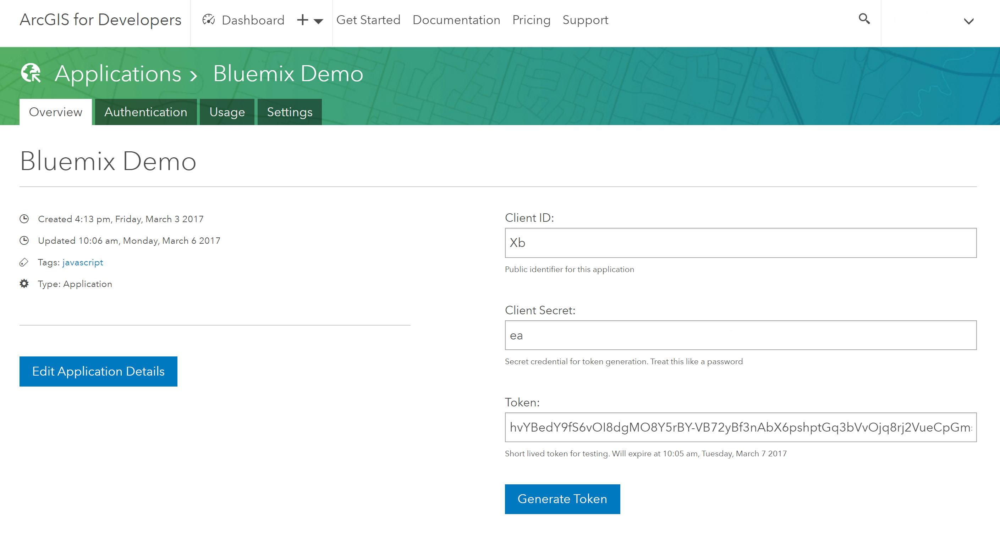

---

copyright:

  years:  2017

lastupdated: "2017-03-15"

---

{:new_window: target="_blank"}
{:shortdesc: .shortdesc}
{:screen:.screen}
{:codeblock:.codeblock}
{:pre: .pre}


# Getting started with Esri ArcGIS for Developers
{: #gsEsriArcGISforDev}
[Esri's ArcGIS APIs and SDKs](https://developers.arcgis.com/documentation/) allow you to create apps that include mapping, visualization, and analysis on Bluemix. ArcGIS for Developers has [ready to use REST services](https://developers.arcgis.com/features/) such as [Directions](https://developers.arcgis.com/features/directions/), [Geocoding](https://developers.arcgis.com/features/geocoding/), and [Geoenrichment](https://developers.arcgis.com/features/geo-enrichment/) that you can use in your Bluemix application.

To get started using ArcGIS on Bluemix:

1. Sign up for a free [ArcGIS Developer Account](https://developers.arcgis.com/sign-up/). 
2. Sign in to [ArcGIS for Developers](https://developers.arcgis.com/sign-in/).
3. Go to the [applications list](https://developers.arcgis.com/applications/).
4. Select ["Create New App](https://developers.arcgis.com/applications/#/new/) and register your application.

	Now that you have registered your application and obtained a `client_id` and `client_secret`, you can implement your app login to obtain a token. ArcGIS offers many paths 
	to assist you with this process. There is an [ArcGIS API for JavaScript](https://developers.arcgis.com/javascript) and [ArcGIS Runtime SDKs](https://developers.arcgis.com/arcgis-runtime) you can choose to implement in your app. Or you can work directly with the [ArcGIS REST API](http://resources.arcgis.com/en/help/arcgis-rest-api/#/The_ArcGIS_REST_API/02r300000054000000/).
	For this sample, we are going to use the token that was generated when you registered your application along with HTTP POST requests and JSON responses using Python. Remember this is a short lived token and you will be responsible for creating that token and also maintaining the security of those credentials. We are also going to use the geoenrichment service to find a location's demographic characteristics. To view the data sets available with the geoenrichment service check out the [data browser](http://doc.arcgis.com/en/esri-demographics/) on the esri demographics page. 

	

5. Copy the token string in your registered application. If this has expired go ahead and renew it by clicking the `Generate Token` button.
6. Open your favorite Python IDE and create a new project using Python 3. 
7. Install the requests module if you don't have it.

	```python
	import requests
	
	```
8. Add the parameters for the request and copy/paste your token string. 

	```python
	params = {
		'f': 'json',
		'token': 'ILWJQ7doxrui_NnKE2skv3mYXUTcMPEy0ndgkJs8H5f76DfEtk7iGATMx_OP4RCkF3Bv6NK0MRbt1WLjj6-x1u3WiUkK2XPyY2BJ233hEHbjDaete8vYpn0ZNvlOLeDpUlaYuCNfHBAMFumINpRUmA..',
    	'studyAreas': '[{"geometry":{"x":-97.741,"y":30.268}}]',
    	'analysisvariables':'["populationtotals.TOTPOP_CY","Wealth.MEDHINC_CY","5yearincrements.MEDAGE_CY"]'
	}
	```
9. Set the geoenrichment service to use and post the request.

	```python
	url = 'http://geoenrich.arcgis.com/arcgis/rest/services/World/GeoenrichmentServer/Geoenrichment/enrich'
	data = requests.post(url, params=params)

	print(data.json())

	```
10. This request will generate a 1-mile ring buffer around the point location with the following attributes: total population, median household income, and median age.

	```	json
	"features" : [ {
			"attributes" : {
				"ID" : "0",
            	"OBJECTID" : 1,
            	"sourceCountry" : "US",
            	"areaType" : "RingBuffer",
            	"bufferUnits" : "esriMiles",
            	"bufferUnitsAlias" : "Miles",
            	"bufferRadii" : 1,
            	"aggregationMethod" : "BlockApportionment:US.BlockGroups",
            	"HasData" : 1,
            	"TOTPOP_CY" : 23048,
            	"MEDHINC_CY" : 52270,
            	"MEDAGE_CY" : 36.8
			}
			} ]
	```
11. Now that you're familiar with accessing services, you can now add those to some cool [maps](http://www.arcgis.com/features/maps/index.html).  

# Related Links
{: #rellinks notoc}

## Tutorials and Samples
{: #samples}

1. [Getting Started with Creating a 2D Map](https://developers.arcgis.com/javascript/latest/sample-code/get-started-mapview/index.html){:new_window}
2. [Getting Started with Creating a 3D Map](https://developers.arcgis.com/javascript/latest/sample-code/get-started-sceneview/index.html){:new_window}
3. [GeoEnrichment Service](https://developers.arcgis.com/rest/geoenrichment/api-reference/input-xy-locations.htm){:new_window}

## SDK
{: #sdk}

* [ArcGIS API for JavaScript Guide](https://developers.arcgis.com/javascript/latest/guide/index.html){:new_window}

## API Reference
{: #api}

* [ArcGIS API for JavaScript](https://developers.arcgis.com/javascript/latest/api-reference/index.html){:new_window}


## Compatible Runtimes
{: #buildpacks}

* [ArcGIS Runtime SDK for iOS](https://developers.arcgis.com/ios/latest/){:new_window}
* [ArcGIS Runtime SDK for Android](https://developers.arcgis.com/android/latest/){:new_window}

## Related Links
{: #general}

* [ArcGIS API for JavaScript Samples](https://developers.arcgis.com/javascript/latest/sample-code/index.html){:new_window}
* [ArcGIS Runtime SDK for iOS Samples](https://developers.arcgis.com/ios/latest/swift/sample-code/sample-code.htm){:new_window}
* [ArcGIS Runtime SDK for Android Samples](https://developers.arcgis.com/android/latest/sample-code/sample-code.htm){:new_window}
