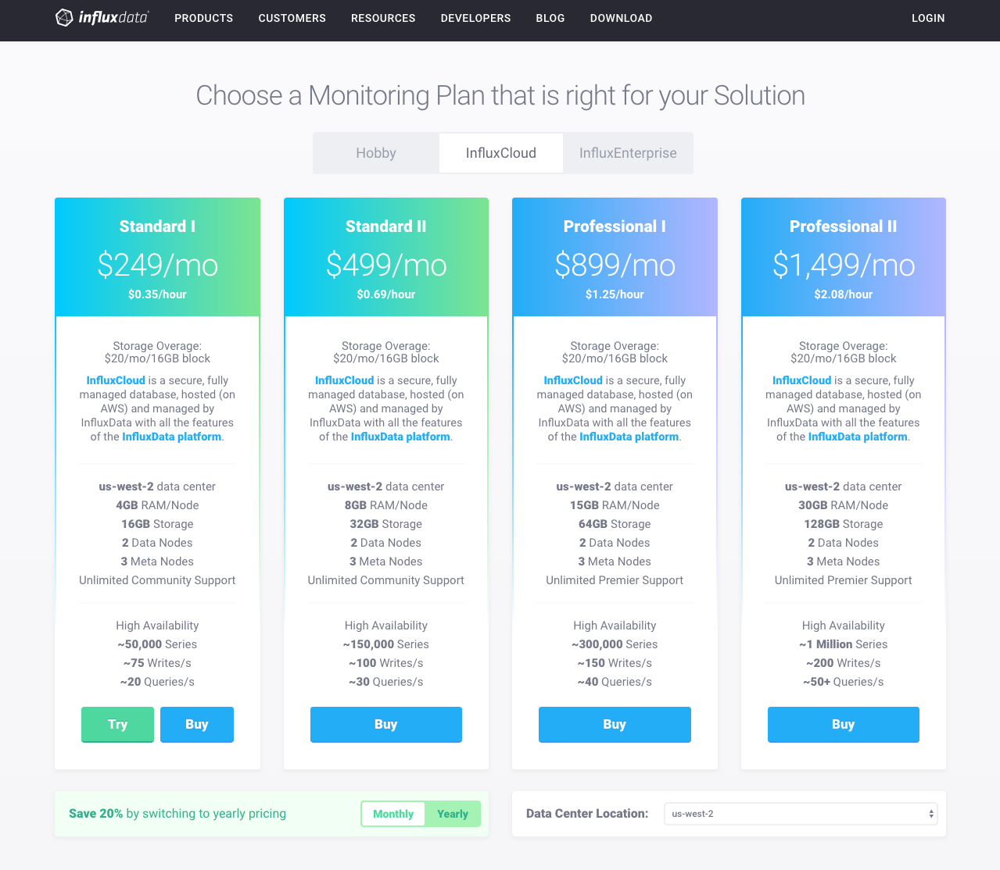
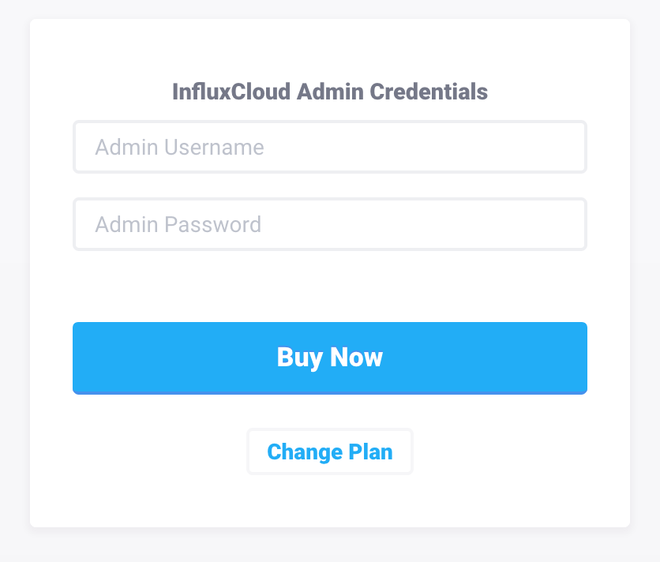
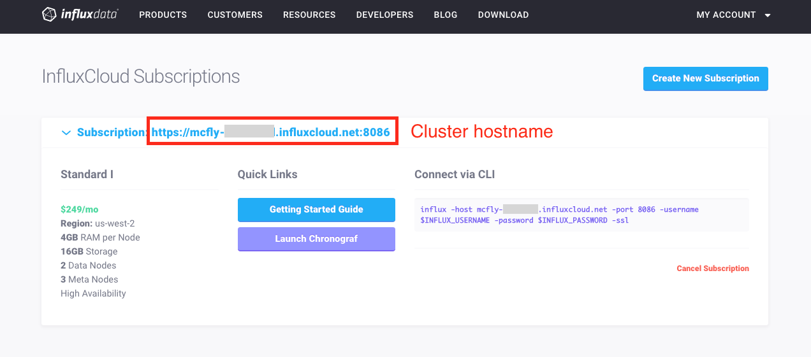

---

copyright:

  years:  2017

lastupdated: "2017-08-16"

---

{:new_window: target="_blank"}
{:shortdesc: .shortdesc}
{:screen:.screen}
{:codeblock:.codeblock}
{:pre: .pre}

# Getting started with InfluxCloud on {{site.data.keyword.Bluemix_notm}}
{: #gettingstarted_InfluxCloud}

The [InfluxCloud](https://cloud.influxdata.com/) on {{site.data.keyword.Bluemix_notm}} is a cloud service for storing metric, event, and time-series data using the [InfluxData platform](https://www.influxdata.com/).
An InfluxCloud cluster provides an [InfluxDB Enterprise](https://www.influxdata.com/influxenterprise/) cluster for time series storage, a [Kapacitor](https://www.influxdata.com/time-series-platform/kapacitor/) node to create alerts, and [Chronograf](https://www.influxdata.com/time-series-platform/chronograf/) to create dashboards.
InfluxCloud exposes the [InfluxDB](http://docs.influxdata.com/influxdb/v1.3/guides/writing_data/) and [Kapacitor](http://docs.influxdata.com/kapacitor/v1.3/api/api/) HTTP APIs.
{:shortdesc}

To get up and running quickly on InfluxCloud service, follow these steps:

1. Sign into [InfluxCloud](https://cloud.influxdata.com/){: new_window} or [register for a free trial](https://cloud.influxdata.com/trial/user){: new_window}.

	

2. Record the admin credentials during the InfluxCloud cluster creation flow, these will be used later for the "Username" and "Password" fields in the {{site.data.keyword.Bluemix_notm}} InfluxCloud service creation page.

	

3. Once the cluster creation flow is complete, the newly provisioned cluster will spin up and be displayed on the dashboard after a few minutes. You'll want to record the hostname of your newly created cluster.

	

4. Add the credentials and hostname of the InfluxCloud cluster to a new {{site.data.keyword.Bluemix_notm}} service.

	

5. Follow the [InfluxCloud Getting Started guide](https://help.influxcloud.net/getting_started/) to learn more about how to integrate your {{site.data.keyword.Bluemix_notm}} applications with InfluxCloud.

## About

The InfluxData platform includes
- [Telegraf](https://www.influxdata.com/time-series-platform/telegraf/), a collection agent with plug-ins to easily gather metrics from 80+ services
- [InfluxDB](https://www.influxdata.com/time-series-platform/influxdb/), a high-performance database for metrics and analytics
- [Chronograf](https://www.influxdata.com/time-series-platform/chronograf/), a visual user interface for graphing InfluxDB data and creating Kapacitor alerts
- [Kapacitor](https://www.influxdata.com/time-series-platform/kapacitor/), a metrics and event processing and alerting engine
