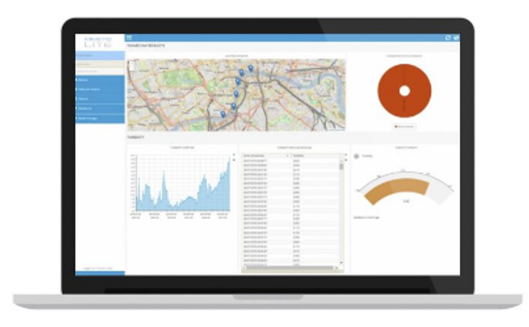

---

copyright:

  years: 2017

lastupdated: "2017-03-10"

---

{:new_window: target="_blank"}
{:shortdesc: .shortdesc}
{:screen:.screen}
{:codeblock:.codeblock}
{:pre: .pre}

# Getting started with MIIMETIQ Dashboards and Reports for Watson IoT
{: #gettingstarted}

NEXIONA presents MIIMETIQ Dashboards and Reports; a simple way to create custom Reports and Dashboards for your Watson IoT Proof of Concept. As new 'widgets' are added, data from devices is immediately displayed either as a current value, values over time (in graphical or tabular view) or located on a map. Multiple layouts can be created per project. An ideal way to prove concepts before scaling up to the full project using the Watson IoT Platform. {:shortdesc}

To get up and running quickly with MIIMETIQ Dashboards and Reports, once you have signed up for an account and have the appropriate sign in credentials, follow these steps:

1. [Log into MIIMETIQ LITE](http://lite.trial.nexiona.io/#dashboard) and enter the correct user credentials.
2. Once the MIIMETIQ LITE application is open you will be able to access only the 'Dashboards' menu, shown on the left hand side.
3. You will notice a '?' at the top right. By selecting this two options are shown: Quick Start Guide and Video Tutorials. Select 'Quick Start Guide'; by stepping through this guide you will quickly become familiar with the Dashboards and Reports section of MIIMETIQ LITE.
2. After stepping through the Quick Start Guide select [Video Tutorials](https://www.youtube.com/watch?v=8M3WmZbGAyE&index=4&list=PLSkT4X0x-Kkgd-ZPr57Pfqja8tmoH-6QP), here you will find a short instructional video on how to create Dashboards and Reports.

# Related Links
{: #rellinks notoc}

## Tutorial Video
{: #samples}

* [MIIMETIQ LITE Dashboards and Reports](https://www.youtube.com/watch?v=8M3WmZbGAyE&index=4&list=PLSkT4X0x-Kkgd-ZPr57Pfqja8tmoH-6QP){:new_window}

## Related Links
{: #general}

* [MIIMETIQ LITE Overview Video](https://youtu.be/C6UQYY5xVJg){:new_window}
* [MIIMETIQ LITE Data sheet](https://youtu.be/C6UQYY5xVJg){:new_window}
