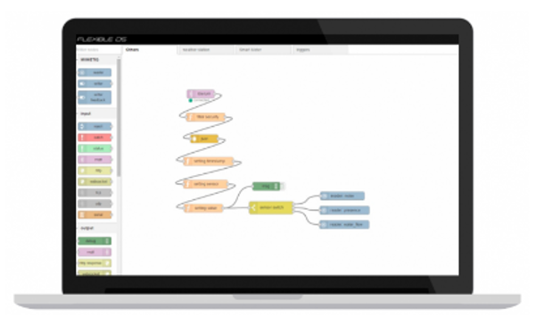

---

copyright:

  years: 2017

lastupdated: "2017-03-10"

---

{:new_window: target="_blank"}
{:shortdesc: .shortdesc}
{:screen:.screen}
{:codeblock:.codeblock}
{:pre: .pre}

# Getting started with MIIMETIQ Device Connect and Manage for Watson IoT
{: #gettingstarted}

NEXIONA presents MIIMETIQ Device Connect & Manage; a simple way to manage, add, delete, replicate and extract data from devices for your Watson IoT project. Quickly capture data from any type of IoT device, using any type of communication protocol - ideal for Proof of Concept where several types of device need to be tested and where a seamless method for feeding data from devices into the Watson IoT Platform is required. 
{:shortdesc}

To get up and running quickly with MIIMETIQ Device Management, once you have signed up for an account and have the appropriate sign in credentials, follow these steps:

1. [Log into MIIMETIQ LITE](http://lite.trial.nexiona.io/#dashboard) and enter the correct user credentials.
2. Once the MIIMETIQ LITE application is open you will be able to access only the 'MIIMETIQ Device Management' and 'Flexible DS' menus, shown on the left hand side.
3. You will notice a '?' at the top right. By selecting this two options are shown: Quick Start Guide and Video Tutorials. Select 'Quick Start Guide'; by stepping through this guide you will quickly become familiar with the MIIMETIQ Device Management and Flexible DS sections of MIIMETIQ LITE.
2. After stepping through the Quick Start Guide select [Video Tutorials](https://www.youtube.com/watch?v=vmnOdSrzfLk&list=PLSkT4X0x-Kkgd-ZPr57Pfqja8tmoH-6QP&index=1), here you will find a short instructional video on how to Connect and Manage Devices, including the Flexible DS section.

# Related Links
{: #rellinks notoc}

## Tutorial Videos
{: #samples}

* [MIIMETIQ LITE Device Management](https://www.youtube.com/watch?v=Vacn3QT2pZk&list=PLSkT4X0x-Kkgd-ZPr57Pfqja8tmoH-6QP&index=3){:new_window}
* [MIIMETIQ LITE Flexible DS - Flow Programming System](https://www.youtube.com/watch?v=Cux-QHV5XO4&list=PLSkT4X0x-Kkgd-ZPr57Pfqja8tmoH-6QP&index=6){:new_window}

## Related Links
{: #general}

* [MIIMETIQ LITE Overview Video](https://youtu.be/C6UQYY5xVJg){:new_window}
* [MIIMETIQ LITE Data sheet](https://youtu.be/C6UQYY5xVJg){:new_window}
