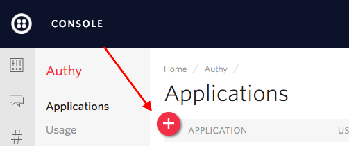
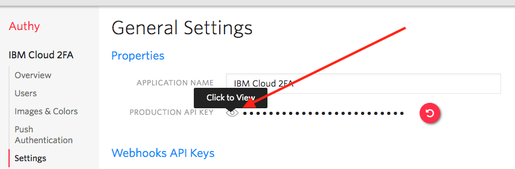
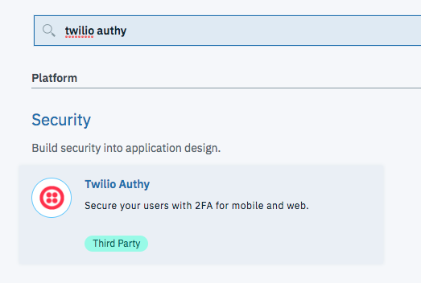

---

copyright:

  years:  2017-2018

lastupdated: "2018-02-06"

---

{:new_window: target="_blank"}
{:shortdesc: .shortdesc}
{:screen:.screen}
{:codeblock:.codeblock}
{:pre: .pre}

# Getting started with Twilio Authy Two-Factor Authentication and IBM Cloud
{: #gettingstarted_TwilioTwo-FactorAuthentication}

[Twilio’s Authy](https://www.twilio.com/two-factor-authentication){: new_window}
lets you easily build an additional measure of security into your login or
verification process with two-factor authentication. Using Twilio’s Authy Authenticator App on your mobile
device, you can increase your confidence in the user logging in and help your
users protect their accounts with easy-to-implement Two-Factor Authentication.
{: shortdesc}

## About

Today we’re going to build a sample Authy App the
serverless way... with IBM Cloud and the Compose for MongoDB integration on the
backend. This example is based on our
[Twilio Authy Tutorial](https://github.com/TwilioDevEd/account-security-2fa-node){: new_window}.

## Building the Project

Follow these simple steps to get started with Twilio Authy on
IBM Cloud:

1. Using your phone platform’s Application Store download the Authy
   Two-Factor application.
   - Exact steps are platform dependent, but you should link your phone number
     to the Authy app. Our web app will eventually use this to authenticate.

2. Register your phone with Authy.

3. If necessary, download and install the
   [IBM Cloud Command Line Interface](https://console.bluemix.net/docs/starters/install_cli.html){: new_window}
   - Change the API Endpoint
     ```bash
     bluemix api https://api.ng.bluemix.net
     ```
     {: pre}

   - And login
     ```bash
     bluemix login
     ```
     {: pre}

4. Create a new Cloud App, naming it 'Twilio-Two-Factor' or similar (this
   name will be taken, so choose something memorable)

5. While logged into the IBM Cloud Console, create a new Compose for MongoDB App.
   - Click 'Catalog' at the top of the screen
   - Enter 'mongodb'

     

6. Name the app as you wish, and wait for it to be created.

7. When it is finished, click the new Mongo service and 'Create connection +'.
   Connect it to the Authy Two-Factor App.

8. In the Twilio Console’s
   [Account Security Applications Dashboard](https://www.twilio.com/console/authy/applications){: new_window},
   click the '+ New Application' Button:

   

   Name it something like “IBM Cloud Two Factor”

9. In the 'Settings' section (found on the left sidebar) click the "Eye" icon
   to reveal your Production API Key.

   

10. Back in the 'Catalog', add a new Twilio Authy App.
    - Enter 'Twilio Authy' and you should see the integration.
    - Click it to start entering values

  

11. Enter five environment variables:
  ```
  Twilio Account SID
  Twilio Auth Token
  Twilio Phone Number
  Application API Key
  Application Secret
  ```
  {: screen}

    - Your Account SID and Token are found in the [Twilio Console](https://www.twilio.com/console/){: new_window}
    - Grab a SMS capable phone number from your [Phone Number](https://www.twilio.com/console/phone-numbers/incoming){: new_window} inventory
    - Paste in the Application API Key from the above steps
    - Enter any secret key to hash user cookies

12. Clone our branch of the Two Factor Quickstart repository for Node:

    ```bash
    git clone -b ibm-cloud-quickstart https://github.com/TwilioDevEd/account-security-2fa-node.git
    ```
    {: pre}

13. Run `npm install` locally.

14. Push the application to IBM Cloud:

    ```bash
    bluemix app push <Your Twilio App Name>
    ```
    {: pre}

13. Back in the Cloud Console, 'Visit' the site that is now running!

    

14. 'Register' for a new account with your phone number (the one now connected
    to the Authy app).  Log out as soon as you’ve registered.

15. Before you log back in, copy the URL to the App (the same as the 'Visit'
    link, e.g. `https://twilio-quickstart-2fa.mybluemix.net` or similar.)

16. In the back in the Twilio Console on your Authy Application Dashboard,
    navigate to 'Settings' and paste the URL with `/authy/callback` appended
    into the Webhook field.  Save it now.  The ‘Webhooks’ field will look
    something like this:

    

17. Drumroll please - back on the site, "Login" to the account you made 3 steps
    above. Depending on your phone setup, you'll now receive a SMS or a push authentication - `Accept` it and celebrate!

And with that, you’ve successfully built out a serverless Authy application with Twilio, Node.js, and IBM Cloud! Your app’s users will now have
an additional layer of protection while logging into your site, with native Authy
applications for their phones.

But wait, there’s more - you can find all of our
[Node.js communications application tutorials](https://www.twilio.com/docs/tutorials?order_by=-popularity_rank&filter-language=node){: new_window}
on our [Documentation site](https://www.twilio.com/docs/){: new_window}. We’ve got sample
applications and ideas on how to extend your application using our security
and communications services and products.

Where you go from here is up to you - we can’t wait to see what you build!
