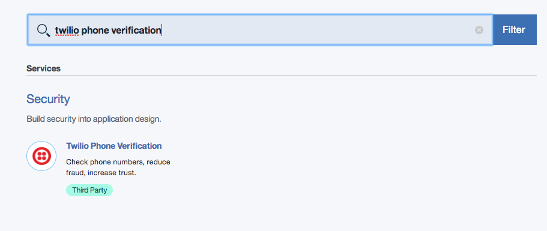
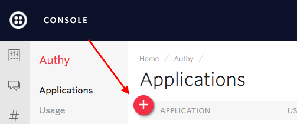
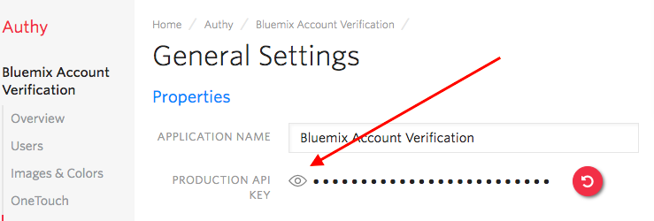
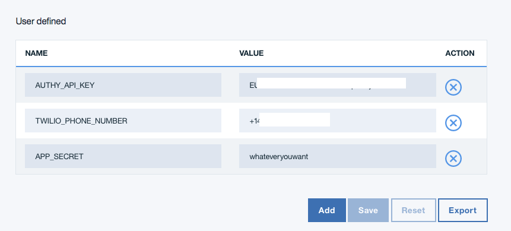

---

copyright:

  years:  2017

lastupdated: "2017-07-27"

---

{:new_window: target="_blank"}
{:shortdesc: .shortdesc}
{:screen:.screen}
{:codeblock:.codeblock}
{:pre: .pre}

# Getting started with Twilio Account Verifiction
{: #gettingstarted_TwilioAccountVerification}


When a customer registers for your App it’s always a good idea that you’re
dealing with… that customer. With
[Twilio Verification](https://www.twilio.com/verification){: new_window}, it’s very easy to
verify that your newest registree has a device in their possession as they hit
the button.
{: shortdesc}

## About

In this sample, you’ll build out a serverless App on IBM Bluemix that will
verify your customer has the phone they are registering. When he or she hits
the register button, they will be texted a code which will need to be
presented to the App to continue. This quickstart is based on
[our Phone Verification with Node.js tutorial](https://www.twilio.com/docs/tutorials/account-verification-node-express){: new_window}.

## Let's build it now!
1. (Optional) On your phone, using your platform’s Application Store download
   the Authy Two-Factor application.
   * Exact steps are platform dependent, but you should link your phone number
   to the Authy app.  Our web app will eventually use this to authenticate.

1. (Optional) Register your phone with Authy.

1. Sign into the [Twilio Console](https://www.twilio.com/console){: new_window}
   or [Register](https://www.twilio.com/try-twilio){: new_window} for a Free
   Account

1. If necessary, download and install the [Bluemix Command Line Interface](https://console.bluemix.net/docs/starters/install_cli.html){: new_window}
   - Change the API Endpoint and Login:

     ```
     bluemix api https://api.ng.bluemix.net
     bluemix login
     ```
     {: codeblock}

1. Log into Bluemix Console and create a Twilio Phone Verification App
      <ol type="a">
        <li>Click 'Catalog' at the top of the screen</li>
        <li>Enter ‘twilio phone verification’</li>
      </ol>

   

1. In the following screen, enter your `Account SID` and `Auth Token` from the
   Twilio Console. In the Twilio Console, your credentials can be found here:

   

1. In the Twilio Console’s Authy Dashboard, click the ‘+ New Application’ Button:
   

1. Click through to the ‘Settings’ page in the left sidebar, and click on “Eye”
   logo to reveal your App API Key:  

   

   Add the App API Key to the service, then 'Create' it!

1. Next, create a new Compose for MongoDB App.
    <ol type="a">
      <li>Click ‘Catalog’ at the top of the screen</li>
      <li>Enter ‘mongodb’</li>
    </ol>
    

1. Name the Service as you wish, and wait for it to be created.

1. Create a new Bluemix Node.js App, naming it ‘Twilio-Phone-Verify’ or similar
   (this name will be taken, so choose something memorable)

1. When it is finished, navigate to the new Mongo service and ‘Create connection +’.
   Connect it to the Twilio Two-Factor App you’ve created.

1. In the [Bluemix Dashboard](https://console.bluemix.net/dashboard/apps/){: new_window},
   click on your  Twilio Phone Verification Service under ‘Services’, then click the
   ‘Create connection +’ button.  Connect it to your Twilio Two-Factor App.

1. Back in the Bluemix Dashboard, navigate to your Authy Two Factor App. In
   ‘Runtime’ on the left side, add one environment variable (and one optional one),
   pasting in the App’s API Key, a Twilio Phone number, and optionally an App Secret:
     ```bash
     TWILIO_PHONE_NUMBER
     ```
     And optionally (do this for sure in production):
     ```bash
     APP_SECRET
     ```
     {: screen}

   

1. Locally, clone our sample application:

    ```bash
    git clone -b bluemix-quickstart https://github.com/TwilioDevEd/account-verification-node
    ```
    {: pre}

1. Deploy the application using the command line tools:

   ```bash
   bluemix app push <Your App Name>
   ```
   {: pre}

1. Back in the Bluemix Console, ‘Visit’ the site that is now running and register

1. Follow the prompts on your phone and the site!

And that’s not all… we’ve got more [Node.js
communications application tutorials](https://www.twilio.com/docs/tutorials?filter-language=node&order_by=-popularity_rank){: new_window} on our [Documentation site](https://www.twilio.com/docs/){: new_window}.
Visit for ideas on what to build into your App, best practices, and code
samples for using Twilio’s security and communications APIs.

What’s next is up to you, but regardless of your path we can’t wait to see what you build!
