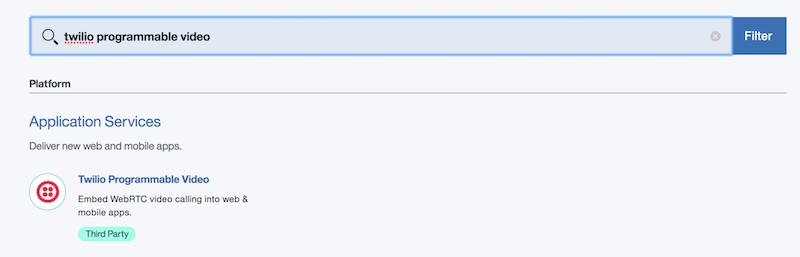

---

copyright:

  years:  2017-2018

lastupdated: "2018-02-06"

---

{:new_window: target="_blank"}
{:shortdesc: .shortdesc}
{:screen:.screen}
{:codeblock:.codeblock}
{:pre: .pre}

# Getting started with Twilio Programmable Video
{: #gettingstarted_TwilioProgrammableVideo}

Twilio’s [Programmable Video](https://www.twilio.com/video){: new_window} makes
it easy to add real-time Video, Voice, and Screen-Sharing to your web
application. Build a rich, interactive web experience and keep your customers
entertained and supported while constantly coming back.
{: shortdesc}

## About

Today we’re going to go sans-servers and build out a sample Video application
on top of IBM Cloud. We’ll use an adaptation of our
[Node.js Quickstart Video Application](https://www.twilio.com/docs/api/video/quickstart-sample-apps){: new_window},
with our JavaScript Client library for the browser. You’ll need to verify
your browser has WebRTC support before continuing and allow access to your
camera and microphone.

## Let's get started!

1. Sign into the [Twilio Console](https://www.twilio.com/console){: new_window}
   or [Register](https://www.twilio.com/try-twilio){: new_window} for a Free
   Account

1. If necessary, download and install the [IBM Cloud Command Line Interface](https://console.bluemix.net/docs/starters/install_cli.html){: new_window}
   - Change the API Endpoint
     ```bash
     bluemix api https://api.ng.bluemix.net
     ```
     {: pre}

   - And login
     ```bash
     bluemix login
     ```
     {: pre}

1. Navigate to the [API Key Creation Screen](https://www.twilio.com/console/video/runtime/api-keys)
   in the Twilio Console. Create a new API Key, saving both the `Key` and the
   `Secret` - you won’t be able to get them back again!

1. Log into IBM Cloud Console and create a Twilio App

   - Click 'Catalog' at the top of the screen
   - Enter 'twilio programmable video'
   - Select it to create an integration

   

1. In the following screen, enter your `Account SID` and `Auth Token` from the
   [Twilio Console](https://www.twilio.com/console).

   

   Also enter the `API Key` and `Secret` you just created in the above step.

1. In the Cloud Console, select 'Catalog' -> 'Apps' -> 'Cloud Foundry Apps'
   then select the `SDK for Node.js`. Name it something memorable.

1. In the IBM Cloud Dashboard, click on your Twilio Service under 'Services',
   then click the 'Create connection +' button. Connect it to your new Node.js
   App.

1. Locally, clone our sample application:

   ```bash
   git clone -b ibm-cloud-quickstart https://github.com/TwilioDevEd/video-quickstart-js
   ```
   {: pre}

1. Run `npm install` in the root directory of the cloned application.

1. Deploy the application using the command line tools:

   ```bash
   bluemix app push <Your App Name>
   ```
   {: pre}

1. In a browser which supports WebRTC, visit `<your Cloud URL>`. Preview
   your camera and join a room.

1. Open a second tab in the same browser and join the same room to verify the
   app works!
   - Or open a second browser (with WebRTC support) on a different machine for
     more fun!.

And with that you’ve built a serverless video chat room!  Feel free to share
that link around to show off the video room you built in under ten minutes(!).

Want to go even further with Twilio? You can find all of our [Node.js
communications application tutorials](https://www.twilio.com/docs/tutorials?filter-language=node&order_by=-popularity_rank){: new_window} on our [Documentation site](https://www.twilio.com/docs/){: new_window}.


We can’t wait to see what you build!
