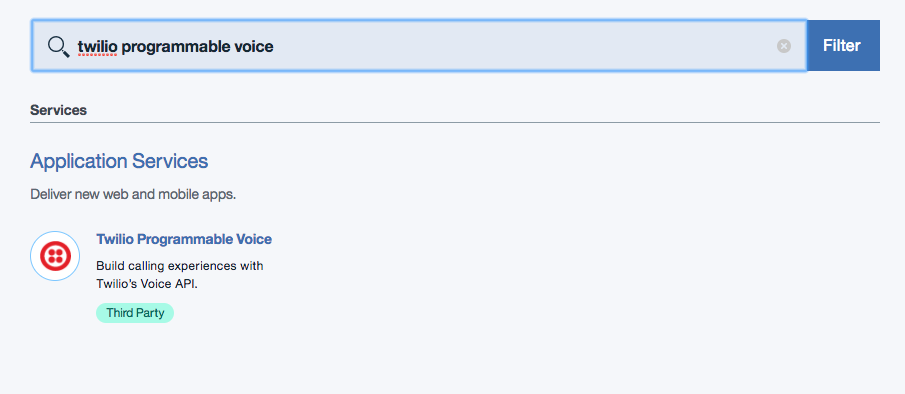
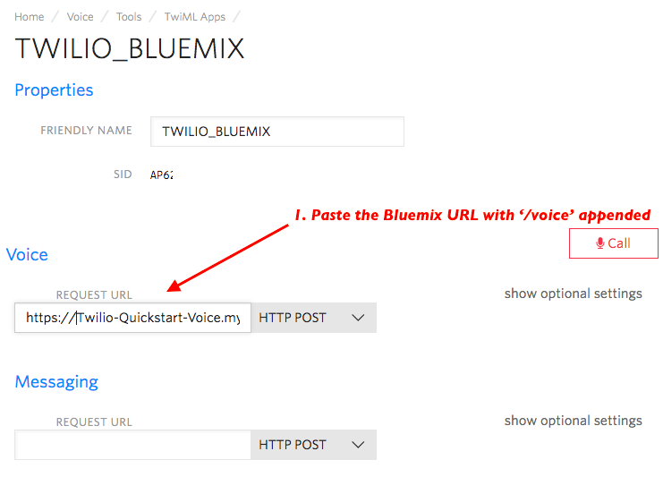
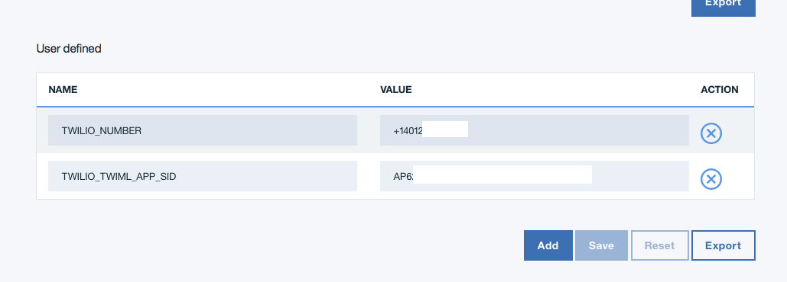

---

copyright:

  years:  2017

lastupdated: "2017-07-26"

---

{:new_window: target="_blank"}
{:shortdesc: .shortdesc}
{:screen:.screen}
{:codeblock:.codeblock}
{:pre: .pre}

# Getting started with Twilio Programmable Voice
{: #gettingstarted_TwilioProgrammableVoice}

Twilio’s [Programmable Voice](https://www.twilio.com/voice) makes it incredibly
easy to add Voice capabilities to your mobile or web application.  Add easy
ingoing and outgoing calling with monitoring and logging capabilities in no time
flat with the power of Twilio’s cloud Voice capabilities.  It’s only a few
steps from our communications APIs to a contact center, unique support
capabilities, browser dialing, or any other application you can dream.
{: shortdesc}

## About

Without spinning up our own server, today we’re going to build a version of
[Twilio’s Node.js Browser Dialer](https://www.twilio.com/docs/tutorials/browser-dialer-node-react)
sample application. You’ll need to own (or purchase) a Voice capable phone
number, and you will need access to a WebRTC capable web browser.

## Let's get started!

1. Sign into the [Twilio Console](https://www.twilio.com/console){: new_window}
   or [Register](https://www.twilio.com/try-twilio){: new_window} for a Free
   Account

1. If necessary, download and install the [Bluemix Command Line Interface](https://console.bluemix.net/docs/starters/install_cli.html){: new_window}
   - Change the API Endpoint and Login:

     ```
     bluemix api https://api.ng.bluemix.net
     bluemix login
     ```
     {: codeblock}

1. Log into Bluemix Console and create a Twilio App

   - Click 'Catalog' at the top of the screen
   - Enter 'twilio'

   

1. In the following screen, enter your `Account SID` and `Auth Token` from the
   Twilio Console. In the Twilio Console, your credentials can be found here:

   

   Once complete (and correct), 'Create' the App.

1. In the Bluemix Console, select 'Catalog' -> 'Apps' -> 'Cloud Foundry Apps'
   then select the `SDK for Node.js`. Name it something memorable.

1. In the Bluemix Dashboard, click on your Twilio Service under 'Services',
   then click the 'Create connection +' button. Connect it to your new Node.js
   App.

1. Navigate to the [TwiML App section](https://www.twilio.com/console/voice/dev-tools/twiml-apps)
   of the Twilio Console and *Create* a new TwiML App.  Name it ‘Bluemix_App’
   or similar.  In the *voice* REQUEST URL section, use the above IBM Bluemix
   URL (the https version) with the /voice path appended.  Also, copy the App SID:

   

1. In the Phone Numbers section of the Twilio Console, either purchase or
   choose an existing voice capable Phone number.  Copy it for usage in the
   Bluemix App.

1. In the Bluemix Dashboard, click on your Twilio Service under ‘Services’,
   then click the ‘Create connection +’ button.  Connect it to your new Node.js App.

1. Navigate back to your Bluemix app and click ‘Runtime’ on the left sidebar.
   In environment variables, set two environment variables. Copy and paste the
   APP Sid and a Voice-capable phone number:

    ```bash
    TWILIO_TWIML_APP_SID
    TWILIO_NUMBER
    ```

    

1. Locally, clone our sample application:

    ```bash
    git clone -b bluemix-quickstart https://github.com/TwilioDevEd/browser-dialer-react
    ```

1. Deploy the application using the command line tools:

   ```bash
   bluemix app push <Your App Name>
   ```

1. In a browser which supports WebRTC, visit `<your Bluemix URL>`.  Enter your
   cell phone number (or any voice capable phone or phone number) in the
   ensuing dialog box and dial!

1. Enjoy a conversation with yourself!

And would you look (listen) at that? You’re dialing a device from the comfort
of your browser, all in under ten minutes! You’ve now got the infrastructure
you need to build a support application or your own custom browser dialing logic.

Want to go even further with Twilio? You can find all of our [Node.js
communications application tutorials](https://www.twilio.com/docs/tutorials?filter-language=node&order_by=-popularity_rank) on our [Documentation site](https://www.twilio.com/docs/).


We can’t wait to see - and hear - what you build!
