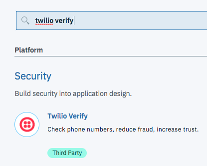
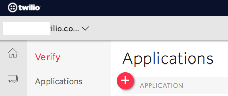
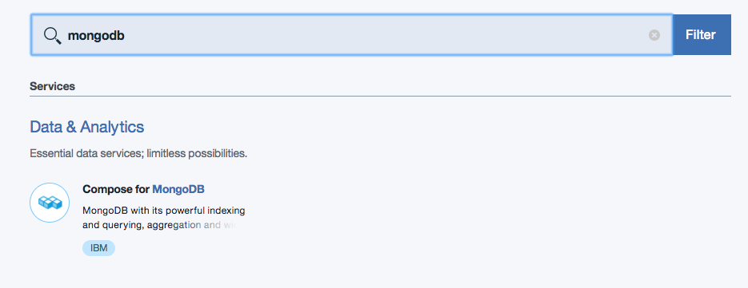
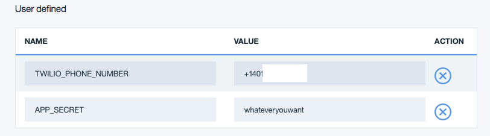

---

copyright:

  years:  2017-2018

lastupdated: "2018-02-06"

---

{:new_window: target="_blank"}
{:shortdesc: .shortdesc}
{:screen:.screen}
{:codeblock:.codeblock}
{:pre: .pre}

# Getting started with Twilio Verify Phone Number Verification
{: #gettingstarted_TwilioAccountVerification}


When a customer registers for your App it’s always a good idea to check that you’re
dealing with… that customer. With
[Twilio Verify](https://www.twilio.com/verify){: new_window}, it’s simple to
verify that your newest registree has a device in their possession as they hit
the 'Register' button.
{: shortdesc}

## About

In this sample, you’ll build out a serverless App on IBM Cloud that will
verify your customers have the phones they register. When they hit
that 'Register' button, they will be texted a code which will need to be
presented to the App to continue. This quickstart is based on
[our Verify with Node.js tutorial](https://www.twilio.com/docs/tutorials/account-verification-node-express){: new_window}.

## Let's Build The App

1. Sign into the [Twilio Console](https://www.twilio.com/console){: new_window}
   or [Register](https://www.twilio.com/try-twilio){: new_window} for a Free
   Account

1. If necessary, download and install the [IBM Cloud Command Line Interface](https://console.bluemix.net/docs/starters/install_cli.html){: new_window}
   - Change the API Endpoint
     ```bash
     bluemix api https://api.ng.bluemix.net
     ```
     {: pre}

   - And login
     ```bash
     bluemix login
     ```
     {: pre}

1. Log in to the IBM Cloud Console and create a Twilio Verify App
      <ol type="a">
        <li>Click 'Catalog' at the top of the screen</li>
        <li>Enter ‘twilio verify’</li>
      </ol>

   

1. In the following screen, enter your `Account SID` and `Auth Token` from the
   [Twilio Console](https://www.twilio.com/console).

   

1. In the [Twilio Console’s Verify Dashboard](https://www.twilio.com/console/verify/){: new_window}, click the ‘+ New Application’ Button:
   

1. Click through to the ‘Settings’ page in the left sidebar, and click on “Eye”
   logo to reveal your App API Key:  

   

   Add the App API Key to the service, then 'Create' it!

1. Next, create a new Compose for MongoDB App.
    <ol type="a">
      <li>Click ‘Catalog’ at the top of the screen</li>
      <li>Enter ‘mongodb’</li>
    </ol>

    

1. Create a new IBM Cloud Node.js App, naming it ‘Twilio-Phone-Verify’ or similar
   (this name will be taken, so choose something memorable)

1. When it is finished, navigate to new Mongo service and ‘Create connection +’.
   Connect it to the Twilio Two-Factor App you’ve created.

1. In the [Cloud Dashboard](https://console.bluemix.net/dashboard/apps/){: new_window},
   click on your Twilio Verify Service under ‘Services’, then click the
   ‘Create connection +’ button.  Connect it to your Twilio Two-Factor App.

1. Back in the IBM Cloud Dashboard, navigate to your Two-Factor Authentication App. In
   ‘Runtime’ on the left side, add one environment variable (and one optional one),
   pasting in a Twilio Phone number and optionally an App Secret:
     ```bash
     TWILIO_PHONE_NUMBER
     ```
     {: screen}

     And optionally (do this for sure in production):

     ```bash
     APP_SECRET
     ```
     {: screen}

   

1. Locally, clone our sample application:

    ```bash
    git clone -b ibm-cloud-quickstart https://github.com/TwilioDevEd/account-verification-node
    ```
    {: pre}

1. Deploy the application using the command line tools:

   ```bash
   bluemix app push <Your App Name>
   ```
   {: pre}

1. Back in the IBM Cloud Console, ‘Visit’ the site that is now running and register

1. Follow the prompts on your phone and the site!

And that’s not all… we’ve got more [Node.js
communications application tutorials](https://www.twilio.com/docs/tutorials?filter-language=node&order_by=-popularity_rank){: new_window} on our [Documentation site](https://www.twilio.com/docs/){: new_window}.
Visit for ideas on what to build into your App, best practices, and code
samples for using Twilio’s security and communications APIs.

What’s next is up to you, but regardless of your path we can’t wait to see what you build!
