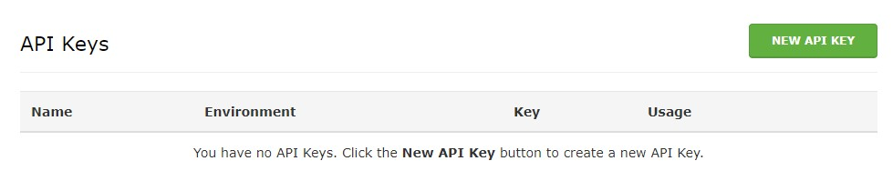
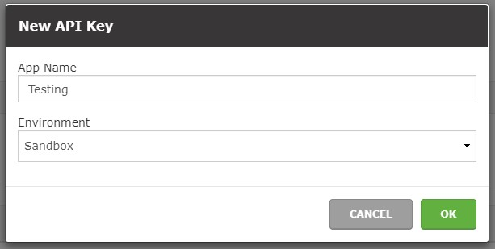

---

copyright:

  years:  2017

lastupdated: "2017-09-11"

---

{:new_window: target="_blank"}
{:shortdesc: .shortdesc}
{:screen:.screen}
{:codeblock:.codeblock}
{:pre: .pre}

<!-- The name of this file should remain index.md -->

# Getting started with the WealthEngine API
{: #gettingstarted_WealthEngineAPI}

The WealthEngine API, available in the IBM Bluemix catalog, lets you look up the net worth and financial capacity of almost anyone in the U.S. in real time giving insight into the wallet share of clients and prospects. Simple to use, it's a restful API that returns JSON.
{:shortdesc}

To get up and running quickly with the WealthEngine API, follow these steps:

1. Register for a developer account on our [developer site.](https://dev.wealthengine.com/app/#/register?utm_source=partner&utm_medium=web&utm_campaign=ibmbluemix)
	
	
	
2. Check your inbox for a link to verify your email address.
	
3. Once verified, following the prompts to use your new email and password to login. 

	

4. To get sandbox access for testing purposes, click on API Keys. 
	
	
	
5. Click on New API Key to generate a new sandbox API key for your use. 

	
	
6. Give your API key a name and click OK. 

	
	
<!-- Related links section: still REQUIRED but moved to toc file (in your same folder).  Edit there.
-->

