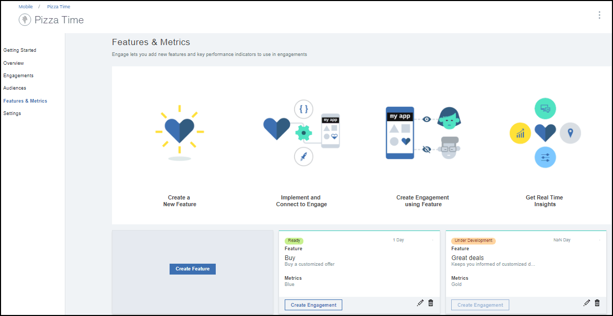
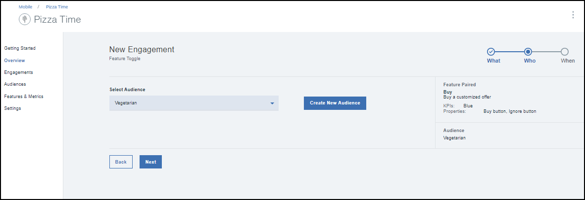
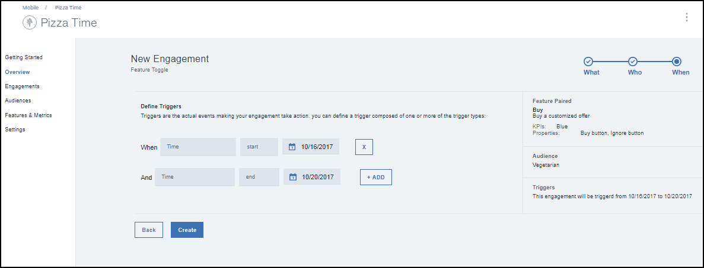
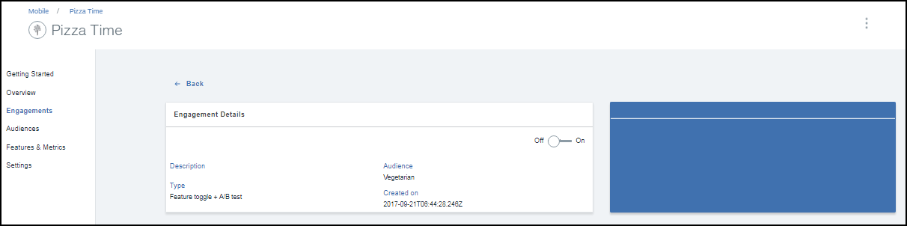

---

copyright:
 years: 2017

---

{:new_window: target="_blank"}
{:shortdesc: .shortdesc}
{:screen:.screen}
{:codeblock:.codeblock}

# Creating an engagement using Feature Toggle
{: #feature_toggle}
Last updated: 24 September 2017
{: .last-updated}

You can create an engagement using Feature Toggle. 

Ensure that you have gone through and have the necessary [prerequisites](app_prerequisites.html) in place.

Complete the following steps to create an engagement using the Feature Toggle:

1. You can create an engagement using either of the following methods:
	- Click **Engagements** in the navigation pane. 
	- Select **Create Engagements** on the new Feature that you have created.
	
2. The New Engagement window appears. 
3. Select the custom feature that you have created. You can choose to set the default value of the feature to **On**. 
	

4. Select an audience. 
	

5. Click **Next**.
6. Define a trigger by choosing Time and the start date and an end date.
	
7. Click **Create**.
8. The new engagement now appears in the Engagement Details window.
	

You can now measure the [performance]( of your engagement.

