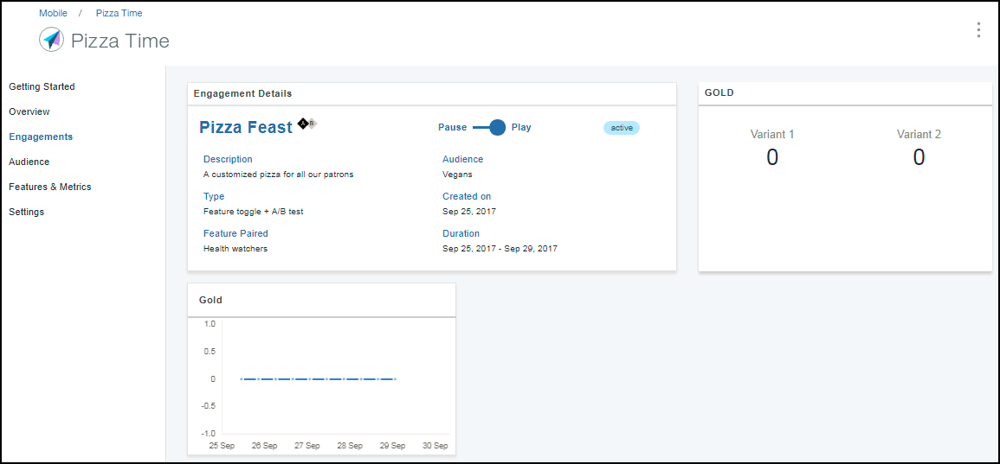

---

copyright:
 years: 2017

---

{:new_window: target="_blank"}
{:shortdesc: .shortdesc}
{:screen:.screen}
{:codeblock:.codeblock}

# Analyzing the feature response
{: #applaunch_type}
Last updated: 29 September 2017
{: .last-updated}

App Launch empowers you to create and collect Feature Metrics for the various engagements that you have created.

Ensure that you have gone through and have completed the [prerequisites](app_prerequisites.html) and have [created an engagement using Feature Control](app_feature_toggle.html). 

Complete the following steps to collect metrics for the engagements that you have created:

1. Click **Engagements**.

2. Choose the engagement that you have created. 

	The Engagement Details window depicts all the information available. 
	

