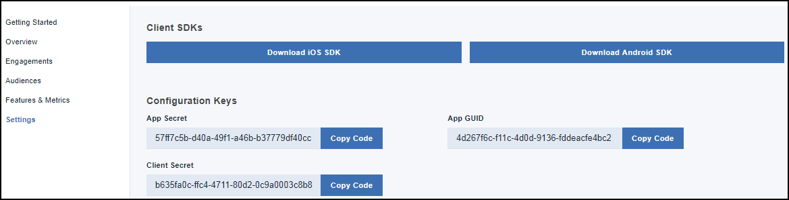
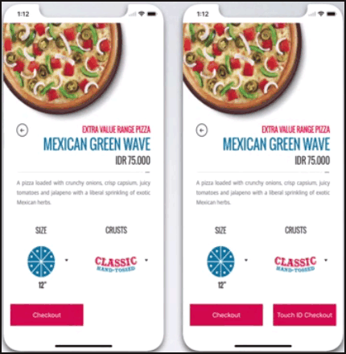
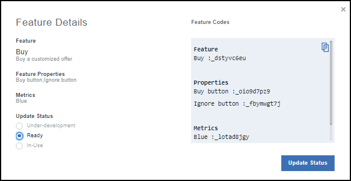
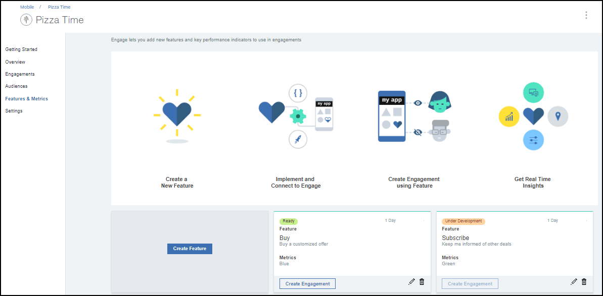
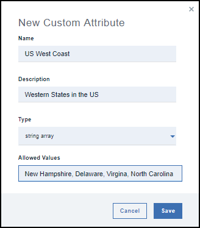
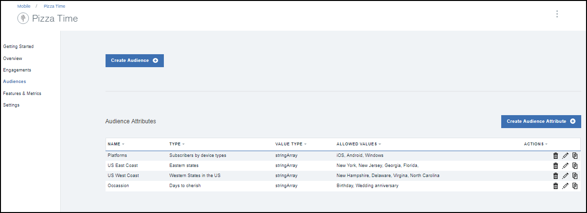

---

copyright:
 years: 2017

---

{:new_window: target="_blank"}
{:shortdesc: .shortdesc}
{:screen:.screen}
{:codeblock:.codeblock}

# Prerequisites
{: #prerequisites}
Last updated: 06 October 2017
{: .last-updated}

## Creating an App Launch service instance
{: #prerequisites_1}

1. In the [IBM Bluemix Catalog](https://console.ng.bluemix.net/catalog/), click **Mobile** > **App Launch**.
2. Provide a Service name and a Credential name.
3. Choose to connect to other existing apps, or leave it unbound.
4. Click **Create**.

You can choose to create either a bound service or an unbound service. Bound services are connected to other Bluemix apps, while unbound apps are standalone and not connected to other apps. App Launch service apps are unbound by default.

## Initializing your app
{: #prerequisites_app}

1. Click **Settings**.
1. Download either of the SDK's, based on your platform type. You can alternatively download the SDK's at: 
	- [iOS](https://github.ibm.com/Engage/bms-clientsdk-ios-swift-engage)
	- [Android](https://github.ibm.com/Engage/bms-clientsdk-android-engage)

2. Copy the configuration keys to initialize your App. Use the App Secret, App GUID, and Client Secret to configure your app and create engagements.

## Creating a feature
{: #prerequisites_2}

The {{site.data.keyword.engageshort}} service allows you to create and test responses to features. 

Consider the following new feature being rolled out for a Pizza outlet - **Touch ID Checkout**. Note that this appears only to a select customer base, and would be in addition to the existing checkout button.

To create a feature, complete the following steps:

1. Click **Features and Metrics** > **Create Feature**.

2. Update the Create New Feature and Metrics form with an appropriate feature name and description. You can also define the feature properties and add metrics to measure the impact of your engagement.

3. Click **Create**. The new feature now appears on the Features and Metrics panel. 

4. To enable a feature to be used as an engagement, click the Feature that you have created.

5. In the Feature Details window, choose to Update Status of your feature to **Ready**.

6. Click **Update Status**.

7. The feature is now ready to be used.

## Creating an audience
{: #prerequisites_2}

To create an audience, complete the following steps:

1. Create an audience attribute. 

	a. Click **Audience** > **Create Audience Attribute**.

	b. Provide the following values:

	- **Name**: Provide an appropriate name for the attribute.
	- **Description**: A brief description on the attribute.
	- **Type**:	Choose the attribute type.
	- **Allowed values**: Enter the attribute values that you would want to use.

	

	You can choose to create multiple audience attributes, as listed in the following image, based on your requirement.
	
	

2. Create an audience.

	a. Click **Create Audience**.

	b. Provide an appropriate name and description on the New Audience window.

	c. Select an attribute, and click **Add**.

	

	d. Choose the required options from the listed attributes.

	e. Click **Save**.

You can now create an engagement using the [Feature Control](app_feature_toggle.html) option.