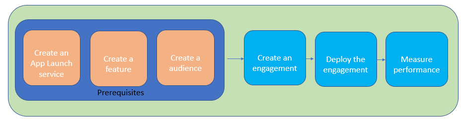

---

copyright:
years: 2017

---

{:new_window: target="_blank"}
{:shortdesc: .shortdesc}
{:screen:.screen}
{:codeblock:.codeblock}
{:pre: .pre}
{:tip: .tip}

# Getting started tutorial
{: #gettingstartedtemplate}
Last updated: 23 September 2017
{: .last-updated}

{:shortdesc}

The App Launch service is an IBM Bluemix experimental offering that empowers you to measure customer engagement by providing a platform to create targeted engagements across cross-sections of your audience. The service provides insights into customer preferences and pain points as an outcome of the engagements, and helps you personalize the app for better customer experience.

The basic steps that will get you started:

1. [Complete the prerequisites](/docs/services/app-launch/app_prerequisites.html)
1. [Create an engagement](/docs/services/app-launch/app_decide_eng.html)
2. [Measure the performance]()

The following image gives you an overview of the App Launch service life cycle.

  

